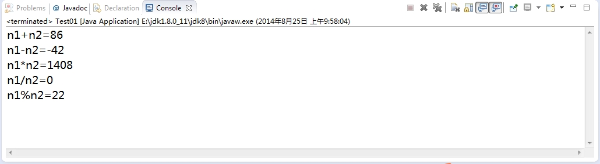

##java基础练习
***
1.2.1 选择题
+ 1.2.1.1 以下有关标识符说法正确的是:C

    A．任何字符的组合都可形成一个标识符。
    
    B．Java的保留字也可作为标识符使用。
    
    C．标识符是以字母、下划线或$开头，后跟字母、数字、下划线或$ 的字符组合。
    
    D．标识符是不区分大小写的。

+ 1.2.2.1 以下哪一组标识符是正确的：D

    A．c_name,  if,  _name
    
    B．c*name,  $name,  mode
    
    C．Result1,  somm1,  while
    
    D．$ast,  _mmc,  c$_fe

+ 1.2.3.1 下列哪个选项是合法的标识符:B

	A.  123    
    
    B. _name    
    
    C.  class   
    
    D.  1first

+ 1.2.4.1 有关整数类型说法错误的是：C

    A．byte,short,int,long都属于整数类型,分别占1,2,4,8个字节。
    
    B．占据字节少的整数类型能处理较小的整数，占据的字节越多，处理的数据范围就越大。
    
    C．所有整数都是一样的，可任意互换使用。
    
    D．两个整数的算术运算结果，还是一个整数。

+ 1.2.5.1 对于整型的字面量以下说法正确的是：D

    A．小于128的字面量，系统默认为是字节类型(byte)。
    
	B．小于32768之间的字面量，系统默认为是短整数类型(short)。
    
    C．大于32767之间的字面量，系统默认为是整数类型(int)。
    
    D．所有整数字面量只要没有拖尾的类型标记(L或l)，系统均默认为是整数类型(int)。

+ 1.2.6.1 以下说法正确的是：C

    A．基本字符数据类型有字符和字符串两种。
    
    B．字符类型占两个字节，可保存两个字符。
    
    C．字符类型占两个字节，可保存一个字符。
    
    D．以上说法都是错误的。

+ 1.2.7.1 有关浮点数类型说法正确的是：D

    A．浮点类型有单精度(float)和双精度(double)两种。
    
    B．单精度(float)占4个字节，数据的表示范围是：-3.4E38~3.4E38。
    
    C．双精度(double) 占8个字节数据的表示范围是：-1.7E308~1.7E308。
    
    D．以上说法都正确。

+ 1.2.8.1 关浮点型字面量说法正确的是：D

    A．数字字面量带有拖尾的标记f或F时，系统认为单精度(float)字面量。
    
    B．带有拖尾的标记d或D时，系统认为双精度(double)字面量。
    
    C．当字面量中无拖尾标记，但含有小数点或含有E指数表示时，系统默认为是双精度字面量(double)。
    
    D．以上都正确。

+ 1.2.9.1 关于类型转换说法错误的是：D

    A．低精度类型数据向高精度类型转换时，不会丢失数据精度。
    
    B．系统会自动进行（整型或浮点型）低精度类型数据向高精度类型数据的转换。
    
    C．高精度类型数据向低精度类型数据的转换、整型和浮点型数据之间的转换，必须强制进行，有可能会引起数据丢失。
    
    D．高精度类型数据向低精度类型转换时，也不会丢失数据精度，因为转换是系统进行的。

+ 1.2.10.1 对变量赋值说法错误的是：D

    A．变量只有在赋值后才能使用。
    
    B．boolean类型的变量值只能取true或false。
    
    C．只有同类型同精度的值才能赋给同类型同精度的变量，不同类型不同精度需要转换后才能赋值。
    
    D．不同类型和精度之间也能赋值，系统会自动转换。

+ 1.2.11.1 以下正确的赋值表达式是：C

    A．a = = 5
    
    B．a+5 = a
    
    C．a++
    
    D．a++=b

+ 1.2.12.1 数学式：x2+y2-xy正确的算术表达式是：D

    A．x^2+y^2+xy
    
    B．x*x+y*y+xy
    
    C．x(x+y)+y*y
    
    D．x*x+y*y+x*y

+ 1.2.13.1 以下正确的关系表达式是：C

    A．x≥y
    
    B．x+y<>z
    
    C．>=x
    
    D．x+y!=z

+ 1.2.14.1 以下正确的逻辑表达式是：A

    A．(x+y>7)&&(x-y<1)
    
    B．! (x+y)
    
    C．(x+y>7) || (z=a)
    
    D．(x+y+z)&&(z>=0)

+ 1.2.15.1 有关移位运算的说法是：B

    A．移位运算是一元运算。
    
    B．移位运算是二元运算。是整数类型的二进制按位移动运算。
    
    C．移位运算是二元运算。可以进行浮点数类型的二进制按位移动运算。
    
    D．移位运算是二元运算。可以进行数据的按位移动运算。

+ 1.2.16.1 有关位运算符说法正确的是：D

    A．~求反运算符是一元运算符。&, ^, | 是二元运算符。
    
    B．a&b&c 是先进行a&b的二进制按位与操作，生成的结果再与c进行&操作。
    
    C．位运算只对整型数据不能对浮点数进行位运算。
    
    D．以上3种说法都正确。

+ 1.2.17.1 有关条件运算符(?:)说法正确的是：D

    A．条件运算符是一个三元运算符，其格式是：表达式1 ? 表达式2 : 表达式3
    
    B．格式中的表达式1是关系或逻辑表达式，其值是boolean 值。
    
    C．若表达式1成立，该条件表达式取表达式2的值，否则取表达式3的值。
    
    D．以上说法都正确。

+ 1.2.18.1 下边正确的赋值语句是：A

    A．a=b=c=d+100;
    
    B．a+7=m;
    
    C．a+=b+7=c;
    
    D．a*=c+7=d;

+ 1.2.19.1 有关注释说法正确的是：D

    A．注释行可以出现在程序的任何地方。

    B．注释不是程序的部分，因为编译系统忽略它们。

    C．注释是程序的组成部分。

    D．以上A）、B）说法正确，C）说法错误。

+ 1.2.20.1 下列的哪个选项可以正确用以表示八进制值8:D

	A.  0x8           
    
    B.  0x10           
    
    C.  08        
    
    D.  010

+ 1.2.21.1 下列的哪个赋值语句是不正确的: A

    A.  float f = 11.1;         
    
    B.  double d = 5.3E12;

    C.  float d = 3.14f ;        
    
    D.  double f=11.1E10f;

+ 1.2.22.1 下列的哪个赋值语句是正确的:A D

    A.  char a=12;            
    
    B.  int a=12.0;

    C.  int a=12.0f;           
    
    D.  int a=（int）12.0;

1.2.2 填空题

+ 1.2.2.1

	3.14156F 表示的是 【单精度浮点数3.14156】。

+ 1.2.2.2 阅读程序：

          public class Test1
          {
             public static void  main(String args[])
              {
                 System.out.println( 15/2);
              }
          }

	其执行结果是 【 7 】。

+ 1.2.2.3 设 a = 16，则表达式 a >>> 2 的值是 【  4 】。

+ 1.2.2.4 阅读程序：

          public class Test2
          {
             public static void  main(String args[])
              {
                 int i=10,j=5,k=5;
                 System.out.println(“i+j+k=”+ i+j+k);
              }
          }
          
	其执行结果是 【  20 】。

1.2.3 编程题

+ 1.2.3.1 编写一个应用程序，定义两个整型变量n1,n2。当n1=22，n2=64时计算输出n1+n2，n1-n2，n1*n2，n1/n2，n1%n2的值。

        public class TestExcise {
            public static void main(String[] args) {
                int n1=22,n2=64;
                System.out.println("n1+n2:"+n1+n2);
                System.out.println("n1-n2:"+(n1-n2));
                System.out.println("n1*n2:"+n1*n2);
                System.out.println("n1/n2:"+n1/n2);
                System.out.println("n1%n2:"+n1%n2);
            }
        }
        
    结果截图如下：
    

1.2.3.2 编写一个应用程序，定义两个整型变量n1,n2并赋给任意值。计算输出n1>n2，n1<n2，n1-n2>=0，n1-n2<=0，n1%n2= =0的值。

        public class TestExcise {
            public static void main(String[] args) {
                int n1=11,n2=132;
                System.out.println("n1>n2:"+(n1>n2));
                System.out.println("n1<n2:"+(n1<n2));
                System.out.println("n1-n2>=0:"+(n1-n2>=0));
                System.out.println("n1-n2<=0:"+(n1-n2<=0));
                System.out.println("n%n2==0:"+(n1%n2==0));
            }
        }
        
    结果截图如下：
    
        
1.2.3.3 编写一个应用程序，定义两个float 变量C、F。计算公式C=5/9（F-32），计算当F=60、F=90时，输出C 的值。

        public class TestExcise {
            public static void main(String[] args) {
                 float C;
                 Scanner scanner=new Scanner(System.in);
                 while(true){
                     System.out.println("请输入F的值：");
                     float F=scanner.nextFloat();
                     if(F==0f){
                         break;
                     }
                     C=(5f/9)*(F-32);
                     if(F==60||F==90){
                         System.out.println("C=5/9*（F-32）="+C);
                     }else{
                         System.out.println("请重新输入F的值：");
                     }
                 }
            }
    	}

    结果截图如下：
    

1.2.3.4 编写一个应用程序计算圆的周长和面积，设圆的半径为1.5，输出圆的周长和面积值。

        public class TestExcise {
            public static void main(String[] args) {
                double PI=Math.PI;
                double r=1.5;
                double perimeter=PI*2*r;
                double area=PI*r*r;
                System.out.println("周长为："+perimeter);
                System.out.println("面积为："+area);
            }
        }
        
    结果截图如下：
    

