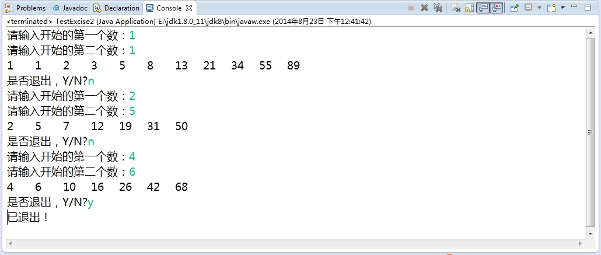
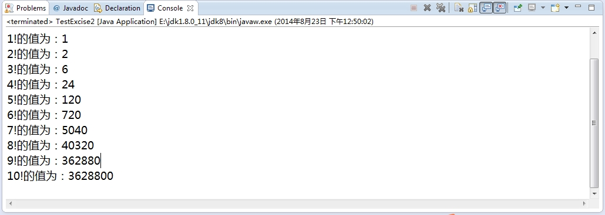
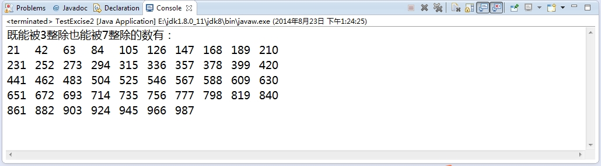
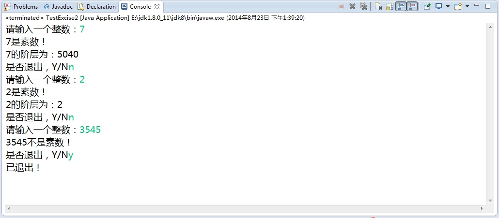

###1.3 Java基础练习（二）

***

+ 1.3.1 为考试成绩划定五个级别，当成绩大于或等于90分时，划定为优；当成绩大于或等于80且小于90时，划定为良；当成绩大于或等于70且小于80时，划定为中；当成绩大于或等于60且小于70时，划定为及格；当成绩小于60时，划定为差.使用if语句

        import java.util.Scanner;
        import java.util.regex.Matcher;
        import java.util.regex.Pattern;

        /**
        * java基础习题（二）
        *
        * @author: chenzhigang
        * @version: date: 2014年8月21日
        * mailto: chenzhigang@foxmail.com
        * blog:http://chenzhigang.github.io/
        * review
        */
        public class TestExcise1 {
            public static void main(String[] args) {
                Scanner scanner = new Scanner(System.in);
                String level = "";// 等级
                while (true) {// 可以多次输入
                    System.out.print("请输入分数：");
                    int score = scanner.nextInt();
                    if (score > 100) {
                        System.out.print("请重新输入正确的分数：");
                        continue;
                    }
                    if (score < 60) {
                        level = "差";
                    } else if (score >= 60 && score < 70) {
                        level = "及格";
                    } else if (score >= 70 && score < 80) {
                        level = "中";
                    } else if (score >= 80 && score < 90) {
                        level = "良";
                    } else {
                        level = "优";
                    }
                    System.out.println("等级为：" + level);
                    System.out.print("是否退出，Y/N?		");
                    String exit = scan.next();
                    Pattern p = Pattern.compile("([y,Y])");// 正则表达式[y,Y]
                    Matcher m = p.matcher(exit);// exit待匹配的字符串
                    if (m.find() || m.matches()) {// m.find()表示匹配子字符串，m.matches()表示匹配整个字符串
                        System.out.println("已退出！");
                        break;
                    }
                }
            }
        }

	运行结果截图如下：
    

+ 1.3.2 使用switch结构重写上面代码

        import java.util.Scanner;
        import java.util.regex.Matcher;
        import java.util.regex.Pattern;

        /**
         * java基础习题（二）
         * 
         * @author: chenzhigang
         * @version: date: 2014年8月21日 
         * mailto: chenzhigang@foxmail.com 
         * blog:http://chenzhigang.github.io/ 
         * review
         */
        public class TestExcise2 {
            public static void main(String[] args) {
                Scanner scanner=new Scanner(System.in);
                String level="";
                String exit="";
                while(true){
                    System.out.print("请输入分数：");
                    int score=scanner.nextInt();
                    if(score>100){
                        System.out.print("请重新输入正确的分数：");
                        continue;
                    }
                    switch(score/10){
                        case 6:
                            level="及格";
                            break;
                        case 7:
                            level="中";
                            break;
                        case 8:
                            level="良";
                            break;
                        case 9:
                            level="优";
                            break;
                        default:
                            level="差";
                    }
                    System.out.println("等级为："+level);
                    System.out.print("是否退出，Y/N?");
                    exit=scanner.next();
                    Pattern p = Pattern.compile("([y,Y])");// 正则表达式[y,Y]
                    Matcher m = p.matcher(exit);// exit待匹配的字符串
                    if (m.find() || m.matches()) {// m.find()表示匹配子字符串，m.matches()表示匹配整个字符串
                        System.out.println("已退出！");
                        break;
                    }
                }
                scanner.close();
            }
        }

  运行结果截图如下：
  

+ 1.3.3 给出年份、月份，计算输出该月的天数 使用switch

        import java.util.Scanner;
        import java.util.regex.Matcher;
        import java.util.regex.Pattern;

        /**
         * java基础习题（二）
         *
         * @author: chenzhigang
         * @version: date: 2014年8月21日
         * mailto: chenzhigang@foxmail.com
         * blog:http://chenzhigang.github.io/
         * review
         */
        public class TestExcise3 {
            public static void main(String[] args) {
                Scanner scanner = new Scanner(System.in);
                while (true) {
                    System.out.print("请输入年份：");
                    int year = scanner.nextInt();
                    System.out.print("请输入月份：");
                    int mouth = scanner.nextInt();
                    if (mouth > 12) {
                        break;
                    }
                    int count = 0;
                    if (year % 4 == 0 && mouth == 2) {
                        count = 29;
                    } else {
                        switch (mouth) {
                        case 1:
                        case 3:
                        case 5:
                        case 7:
                        case 8:
                        case 10:
                        case 12:      //前面的1,3,5,7,8,10,12都同一方式处理
                            count = 31;
                            break;
                        case 2:
                            count = 28;
                            break;
                        default:
                            count = 30;
                            break;
                        }
                    }
                    System.out.println(year + "年" + mouth + "月有" + count + "天");
                    System.out.print("是否退出，Y/N?");
                    String exit = scanner.next();
                    Pattern p = Pattern.compile("([y,Y])");// 正则表达式[y,Y]
                    Matcher m = p.matcher(exit);// exit待匹配的字符串
                    if (m.find() || m.matches()) {// m.find()表示匹配子字符串，m.matches()表示匹配整个字符串
                        System.out.println("已退出！");
                        break;
                    }
                }
                scanner.close();
            }
        }

   运行结果截图如下：
   

+ 1.3.4 计算sum=1+2+3+4+5+…+100 使用for循环

        /**
        * java基础习题（二）
        *
        * @author: chenzhigang
        * @version: date: 2014年8月21日
        * mailto: chenzhigang@foxmail.com
        * blog:http://chenzhigang.github.io/
        * review
        */
        public class TestExcise4 {
            public static void main(String[] args) {
                int sum=0;
                for(int i=1;i<=100;i++){
                    sum+=i;
                }
                System.out.println("1+2+...+100="+sum);
            }
        }

    运行结果截图如下：
     

+ 1.3.5 这是一个古典数学问题：一对兔子从它出生后第3个月起，每个月都生一对小兔子，小兔子3个月后又生一对小兔子，假设兔子都不死，求每个月的兔子对数。该数列为：
1   1   2   3  5   8   13   21…  即从第3项开始，其该项是前两项之和。求100以内的波那契数列 分别使用for与while循环	

        import java.util.Scanner;
        import java.util.regex.Matcher;
        import java.util.regex.Pattern;

        /**
         * java基础习题（二）
         *
         * @author: chenzhigang
         * @version: date: 2014年8月21日
         * mailto: chenzhigang@foxmail.com
         * blog:http://chenzhigang.github.io/
         * review
         */
        public class TestExcise5 {
            public static void main(String[] args) {
                Scanner scanner=new Scanner(System.in);
                while(true){
                    System.out.print("请输入开始的第一个数：");
                    int n1=scanner.nextInt();
                    System.out.print("请输入开始的第二个数：");
                    int n2=scanner.nextInt();
                    int n3=n1+n2;
                    int temp1=n2;
                    int temp2=n3;
                    System.out.print(n1+"	"+n2+"	"+n3+"	");
                    while(true){
                        temp1+=temp2;
                        temp2+=temp1;
                        if(temp2>100){
                            break;
                        }
                        System.out.print(temp1+"	"+temp2+"	");
                    }
                    System.out.println();
                    System.out.print("是否退出，Y/N?");
                    String exit = scanner.next();
                    Pattern p = Pattern.compile("([y,Y])");// 正则表达式[y,Y]
                    Matcher m = p.matcher(exit);// exit待匹配的字符串
                    if (m.find() || m.matches()) {// m.find()表示匹配子字符串，m.matches()表示匹配整个字符串
                        System.out.println("已退出！");
                        break;
                    }
                }
            }
        }

    运行结果截图如下：
    

+ 1.3.6 计算n!, 当n=9时。并分别输出1！~9！各阶乘的值 使用while循环

		import java.util.Scanner;

        /**
        * java基础习题（二）
        *
        * @author: chenzhigang
        * @version: date: 2014年8月21日
        * mailto: chenzhigang@foxmail.com
        * blog:http://chenzhigang.github.io/
        * review
        */
        public class TestExcise {
            public static void main(String[] args) {
                Scanner scanner = new Scanner(System.in);
                System.out.println("请输入一个整数n：");
                int n=scanner.nextInt();
                int sum=1;
                int i=1;
                while(i<=n){
                    sum*=i;
                    System.out.println(i+"!的值为："+sum);
                    i++;
                }
            }
        }

    运行结果截图如下：
     

+ 1.3.7 输出50~100以内的所有素数。所谓素数即是只能被1和其自身除尽的正整数。

        /**
         * java基础习题（二）
         *
         * @author: chenzhigang
         * @version: date: 2014年8月21日
         * mailto: chenzhigang@foxmail.com
         * blog:http://chenzhigang.github.io/
         * review
         */
		public class TestExcise {
            public static void main(String[] args) {
                System.out.println("50~100的素数为：");
                for(int i=50;i<=100;i++){
                    boolean flag=judge(i);
                    if(flag){
                        System.out.print(i+"	");
                    }
                }
            }

            public static boolean judge(int n){
                boolean flag=true;
                for(int i=2;i<n/2;i++){
                    if(n%i==0){
                        flag=false;
                        break;
                    }
                }
                return flag;
            }
        }

	运行结果截图如下：
     

+ 1.3.8 输出10~1000之间既能被3整除也能被7整除的数

		/**
         * java基础习题（二）
         *
         * @author: chenzhigang
         * @version: date: 2014年8月21日
         * mailto: chenzhigang@foxmail.com
         * blog:http://chenzhigang.github.io/
         * review
         */
        public class TestExcise2 {
            public static void main(String[] args) {
                System.out.println("既能被3整除也能被7整除的数有：");
                for(int i=10;i<1000;i++){
                    if(i%3==0&&i%7==0){
                        System.out.print(i+"\t");
                        if((i-10)%10==0){
                            System.out.println();
                        }
                    }
                }
            }
        }

    运行结果截图如下：
    

+ 1.3.9 判断一个正整数是否是素数，若是计算其阶乘。判断素数和阶乘作为方法定义，并在主方法中调用它们

        import java.util.Scanner;
        import java.util.regex.Matcher;
        import java.util.regex.Pattern;

        /**
         * java基础习题（二）
         *
         * @author: chenzhigang
         * @version: date: 2014年8月21日
         * mailto: chenzhigang@foxmail.com
         * blog:http://chenzhigang.github.io/
         * review
         */
        public class TestExcise2 {
            public static void main(String[] args) {
                Scanner scanner = new Scanner(System.in);
                while(true){
                    System.out.print("请输入一个整数：");
                    int n=scanner.nextInt();
                    boolean flag=judge(n);
                    if(flag){
                        muti(n);
                    }
                    System.out.print("是否退出，Y/N");
                    String exit=scanner.next();
                    Pattern p=Pattern.compile("([y,Y])");
                    Matcher m=p.matcher(exit);
                    if(m.find()||m.matches()){
                        System.out.println("已退出！");
                        break;
                    }
                }
                scanner.close();
            }

            public static void muti(int n){
                int sum=1;
                for(int i=1;i<=n;i++){
                    sum*=i;
                }
                System.out.println(n+"的阶层为："+sum);
            }

            public static boolean judge(int n){
                boolean flag=true;
                for(int i=2;i<=n/2;i++){
                    if(n%i==0){
                        flag=false;
                        break;
                    }
                }
                if(flag){
                    System.out.println(n+"是素数！");
                }else{
                    System.out.println(n+"不是素数！");
                }
                return flag;
            }
        }

     运行结果截图如下：
     

