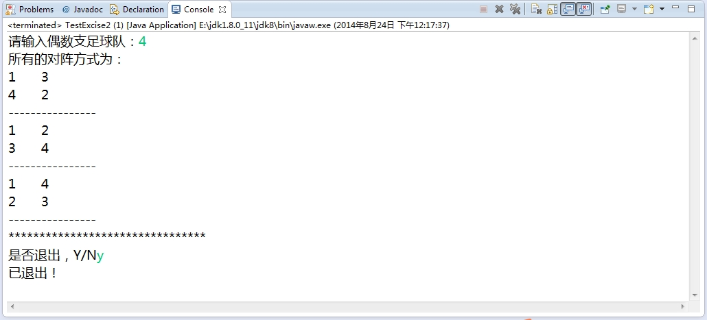
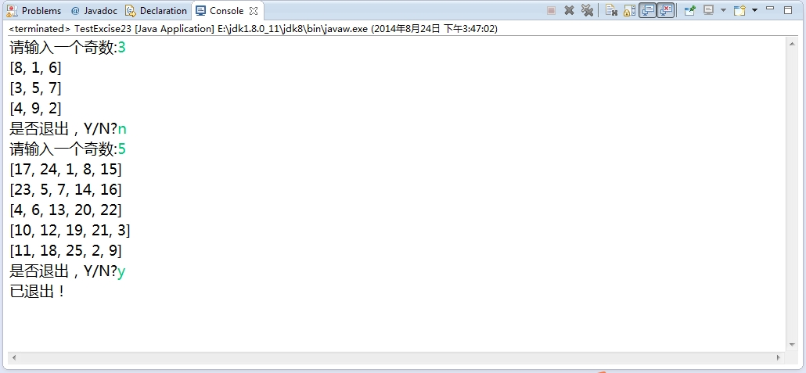
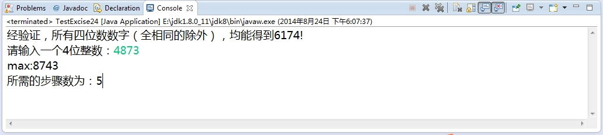

###1.4 Java基础练习（三）

***

+ 1.4.1 写两个方法,其中一个方法可以把某个整数插入到整型数组的特定位置,数组中原有元素向后移动;另一个方法能够从整形数组中特定位置删除掉一个元素,数组中原有元素向前移动

        import java.util.Arrays;
        import java.util.Scanner;
        import java.util.regex.Matcher;
        import java.util.regex.Pattern;

        /**
         * 数组中插入一个数
         *
         * @author: chenzhigang
         * @version:
         * date: 2014年8月23日
         * mailto: chenzhigang505@163.com
         * blog : http://chenzhigang.github.io/
         * review
         */
        public class TestArray4 {
            public static void main(String[] args) {
                Scanner scan=new Scanner(System.in);
                int arr[]={2,5,6,7};
                System.out.println(Arrays.toString(arr));
                while(true){//可以进行多次输入
                    System.out.println("请输入要插入的数据：");
                    int value=Integer.parseInt(scan.nextLine());
                    System.out.println("请输入要插入的位置：");
                    int index =Integer.parseInt(scan.nextLine());
                    if(index>=arr.length){//下表越界，进行扩容
                        //System.out.println("下表越界！");
                        int[] newArray=new int[index+1];
                        for(int i=0;i<arr.length;i++){
                            newArray[i]=arr[i];
                        }
                        newArray[index]=value;
                        arr=newArray;
                    }else{
                        int[] newArray=new int[arr.length+1];
                        for(int i=0;i<index;i++){
                            newArray[i]=arr[i];
                        }
                        newArray[index]=value;
                        for(int i=index;i<arr.length;i++){
                            newArray[i+1]=arr[i];
                        }
                        arr=newArray;
                    }
                    printArray(arr);
                    System.out.println("是否退出，Y/N?");
                    String exit=scan.nextLine();
                    Pattern p=Pattern.compile("([y,Y])");//正则表达式[y,Y]
                    Matcher m=p.matcher(exit);//exit待匹配的字符串
                    if(m.find()||m.matches()){//m.find()表示匹配子字符串，m.matches()表示匹配整个字符串
                        System.out.println("已退出！");
                        break;
                    }
                }
            }
			/**
	 		* 打印数组函数
	 		* @param arr 数组
	 		*/
            public static void printArray(int[] arr){
                for(int i=0;i<arr.length;i++){
                    System.out.print(arr[i]+"\t");
                }
                System.out.println();
            }
        }

     结果截图如下：
     

+ 1.4.2 有偶数支足球队进行单循环比赛,请按照指定算法打印每轮的对阵形势

        import java.util.Arrays;
        import java.util.Scanner;
        import java.util.regex.Matcher;
        import java.util.regex.Pattern;

        /**
         * java基础练习（三）
         *
         * @author: chenzhigang
         * @version:
         * date: 2014年8月24日
         * mailto: chenzhigang505@163.com
         * blog : http://chenzhigang.github.io/
         * review
         */
        public class TestExcise2 {
            public static void main(String[] args) {
                Scanner scanner=new Scanner(System.in);
                while(true){
                    System.out.print("请输入偶数支足球队：");
                    int count=scanner.nextInt();
                    int[] a=new int[count];
                    int[] newArray=new int[count];
                    for(int i=1;i<=count;i++){
                        a[i-1]=i;
                    }
                    newArray=Arrays.copyOf(a,count);
                    System.out.println("所有的对阵方式为：");
                    for(int i=0;i<count-1;i++){
                        newArray[1]=a[count-1];
                        for(int j2=1;j2<count-1;j2++){
                            newArray[j2+1]=a[j2];
                        }
                        //System.out.println(Arrays.toString(newArray));
                        for(int j=0;j<count/2;j++){
                            System.out.println(newArray[j]+"\t"+newArray[count-j-1]);
                        }
                        System.out.println("----------------");
                        a=Arrays.copyOf(newArray,count);
                    }
                    System.out.println("********************************");
                    System.out.print("是否退出，Y/N");
                    String exit=scanner.next();
                    Pattern p=Pattern.compile("([y,Y])");
                    Matcher m=p.matcher(exit);
                    if(m.find()||m.matches()){
                        System.out.println("已退出！");
                        break;
                    }
                }
            }
        }

     结果截图如下：
     

+ 1.4.3 定义一个奇数阶二维数组,把每个元素顺序填入不同的自然数,要求行列和对角线元素相加的结果相等

        import java.util.Arrays;
        import java.util.Scanner;
        import java.util.regex.Matcher;
        import java.util.regex.Pattern;

        /**
         * 
         * java基础练习（三）
         * 
         * 定义一个奇数阶二维数组,把每个元素顺序填入不同的自然数,要求行列和对角线元素相加的结果相等
         *
         * @author: chenzhigang
         * @version:
         * date: 2014年8月21日
         * mailto: chenzhigang505@163.com
         * blog : http://chenzhigang.github.io/
         * review 
         */
        public class TestExcise23 {
            public static void main(String[] args) {
                Scanner scanner=new Scanner(System.in);
                int count=1;
                while(true){
                    System.out.print("请输入一个奇数:");
                    int n=scanner.nextInt();
                    int[][] arr=new int[n][n];
                    int i=0,j=n/2;
                    while(count<n*n){
                        arr[0][n/2]=1;//生成1
                        if(i-1<0&&j+1<n){//生成2
                            i=i+(n-1);
                            j++;
                            arr[i][j]=arr[i-(n-1)][j-1]+1;
                        }else if(i-1>=0&&j+1==n){//生成3
                            i--;
                            j=j-(n-1);
                            arr[i][j]=arr[i+1][j+(n-1)]+1;
                        }else if(j+1<n&&i-1>=0&&arr[i-1][j+1]!=0){//生成4
                            i++;
                            arr[i][j]=arr[i-1][j]+1;
                        }else if(j+1<n&&i-1>=0&&arr[i-1][j+1]==0){//生成5,6
                            i--;
                            j++;
                            arr[i][j]=arr[i+1][j-1]+1;
                        }else if(i-1<0&&j+1==n){//生成7,8,9
                            i++;
                            arr[i][j]=arr[i-1][j]+1;
                        }
                        count++;
                    }
                    for(int k=0;k<n;k++){
                        System.out.println(Arrays.toString(arr[k]));
                    }

                    //还原最初数据
                    if(count==n*n){
                        i=0;
                        j=n/2;
                        count=1;
                        for(int p=0;p<n;p++){
                            for(int q=0;q<n;q++){
                                arr[p][q]=0;
                            }
                        }
                    }
                    System.out.print("是否退出，Y/N?");
                    String exit=scanner.next();
                    Pattern p=Pattern.compile("([y,Y])");//正则表达式[y,Y]
                    Matcher m=p.matcher(exit);//exit待匹配的字符串
                    if(m.find()||m.matches()){//m.find()表示匹配子字符串，m.matches()表示匹配整个字符串
                        System.out.println("已退出！");
                        scanner.close();
                        break;
                    }
                }
            }
        }

     结果截图如下：
     

+ 1.4.4 已知：一个任意的四位正整数。将数字重新组合成一个最大的数和最小的数相减，重复这个过程，最多七步，必得6174。即：7641-1467=6174。将永远出不来.求证：所有四位数数字（全相同的除外），均能得到6174。输出掉进黑洞的步数。

        import java.util.Arrays;
        import java.util.Scanner;

        /**
         *
         * @author: chenzhigang
         * @version:
         * date: 2014年8月24日
         * mailto: chenzhigang505@163.com
         * blog : http://chenzhigang.github.io/
         * review
         */
        public class TestExcise24 {
            public static void main(String[] args) {
                Scanner scanner=new Scanner(System.in);
                int[] maxArray=new int[4];
                int[] minArray=new int[4];
                boolean flag=check(minArray,maxArray);
                if(flag){
                    System.out.println("经验证，所有四位数数字（全相同的除外），均能得到6174!");
                }
                System.out.print("请输入一个4位整数：");
                int a=scanner.nextInt();
                int min=min1(a,minArray,maxArray);
                int max=max1(minArray,maxArray);
                System.out.println("max:"+max);
                int count=0;
                while(true){
                    int result=max-min;
                    min=min1(result,minArray,maxArray);
                    max=max1(minArray,maxArray);
                    count++;
                    if(result==6174){
                        scanner.close();
                        break;
                    }
                }
                System.out.println("所需的步骤数为："+count);
            }

            /**
             *
             * 求输入的4位的整数重新排列后最小的4位数
             *
             * @param a 输入的4位的整数
             * @param minArray 按照升序排列的数组
             * @param maxArray 按照降序排列的数组
             * @return
             */
            public static int min1(int a,int[] minArray,int[] maxArray){
                String minSub="";
                int min=0;
                for(int i=0;i<String.valueOf(a).length();i++){
                    minArray[i]=Integer.parseInt(String.valueOf(a).substring(i,i+1));
                }
                Arrays.sort(minArray);
                for(int i=0;i<4;i++){
                    minSub+=minArray[i];
                }
                min=Integer.parseInt(minSub);
                return min;
            }

            /**
             *
             * 求输入的4位的整数重新排列后最大的4位数
             *
             * @param minArray 按照升序排列的数组
             * @param maxArray 按照降序排列的数组
             * @return
             */
            public static int max1(int[] minArray,int[] maxArray){
                int max=0;
                String maxSub="";
                for(int i=0;i<minArray.length;i++){
                    maxArray[i]=minArray[minArray.length-i-1];
                    maxSub+=maxArray[i];
                }
                max=Integer.parseInt(maxSub);
                return max;
            }

            /**
             *
             * 检验是否是所有的4位数都满足要求
             *
             * @param minArray 按照升序排列的数组
             * @param maxArray 按照降序排列的数组
             * @return
             */
            public static boolean check(int[] minArray,int[] maxArray){
                boolean flag=false;
                int count=0;
                for(int i=1000;i<=9999;i++){
                    if(i%1111!=0){
                        int min=min1(i,minArray,maxArray);
                        int max=max1(minArray,maxArray);
                        while(true){
                            int result=max-min;
                            min=min1(result,minArray,maxArray);
                            max=max1(minArray,maxArray);
                            count++;
                            if(result==6174){
                                break;
                            }
                            if(count<=7){
                                count=0;
                                flag=true;
                            }else{
                                flag=false;
                            }
                        }
                        if(!flag){
                            break;
                        }
                    }
                }
                return flag;
           }
      }

     结果截图如下：
     

