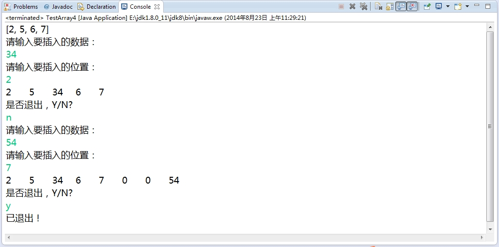

###1.4 Java基础练习（三）

***

+ 1.4.1 写两个方法,其中一个方法可以把某个整数插入到整型数组的特定位置,数组中原有元素向后移动;另一个方法能够从整形数组中特定位置删除掉一个元素,数组中原有元素向前移动

        import java.util.Arrays;
        import java.util.Scanner;
        import java.util.regex.Matcher;
        import java.util.regex.Pattern;

        /**
         * 数组中插入一个数
         *
         * @author: chenzhigang
         * @version:
         * date: 2014年8月21日
         * mailto: chenzhigang@foxmail.com
         * blog : http://chenzhigang.github.io/
         * review 
         */
        public class TestArray4 {
            public static void main(String[] args) {
                Scanner scan=new Scanner(System.in);
                int arr[]={2,5,6,7};
                System.out.println(Arrays.toString(arr));
                while(true){//可以进行多次输入
                    System.out.println("请输入要插入的数据：");
                    int value=Integer.parseInt(scan.nextLine());
                    System.out.println("请输入要插入的位置：");
                    int index =Integer.parseInt(scan.nextLine());
                    if(index>=arr.length){//下表越界，进行扩容
                        //System.out.println("下表越界！");
                        int[] newArray=new int[index+1];
                        for(int i=0;i<arr.length;i++){
                            newArray[i]=arr[i];
                        }
                        newArray[index]=value;
                        arr=newArray;
                    }else{
                        int[] newArray=new int[arr.length+1];
                        for(int i=0;i<index;i++){
                            newArray[i]=arr[i];
                        }
                        newArray[index]=value;
                        for(int i=index;i<arr.length;i++){
                            newArray[i+1]=arr[i];
                        }
                        arr=newArray;
                    }
                    printArray(arr);
                    System.out.println("是否退出，Y/N?");
                    String exit=scan.nextLine();
                    Pattern p=Pattern.compile("([y,Y])");//正则表达式[y,Y]
                    Matcher m=p.matcher(exit);//exit待匹配的字符串
                    if(m.find()||m.matches()){//m.find()表示匹配子字符串，m.matches()表示匹配整个字符串
                        System.out.println("已退出！");
                        break;
                    }
                }
            }
			/**
	 		* 打印数组函数
	 		* @param arr 数组
	 		*/
            public static void printArray(int[] arr){
                for(int i=0;i<arr.length;i++){
                    System.out.print(arr[i]+"\t");
                }
                System.out.println();
            }
        }
        
     结果截图如下：
     
